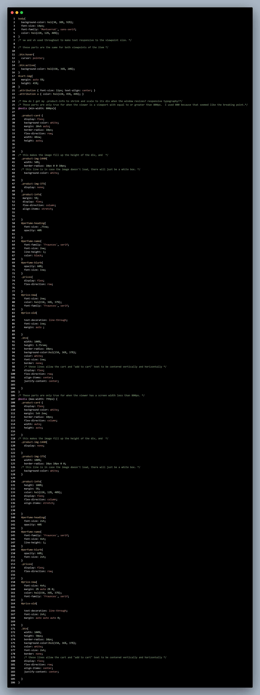
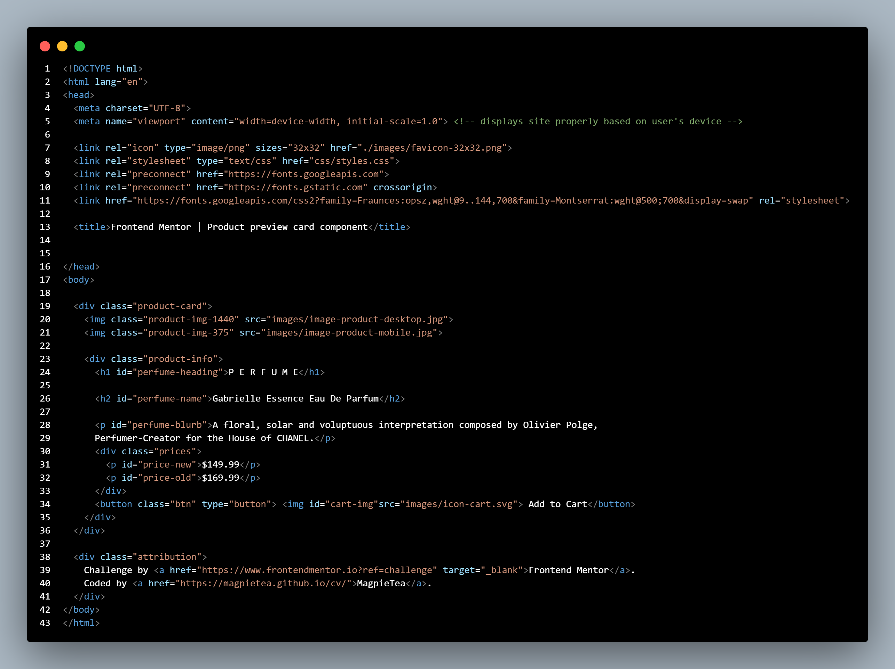

# Frontend Mentor - Product preview card component solution

This is a solution to the [Product preview card component challenge on Frontend Mentor](https://www.frontendmentor.io/challenges/product-preview-card-component-GO7UmttRfa). Frontend Mentor challenges help you improve your coding skills by building realistic projects. 

## Table of contents

- [Overview](#overview)
  - [The challenge](#the-challenge)
  - [Screenshot](#screenshot)
  - [Links](#links)
- [My process](#my-process)
  - [Built with](#built-with)
  - [What I learned](#what-i-learned)
  - [Continued development](#continued-development)
  - [Useful resources](#useful-resources)
- [Author](#author)
- [Acknowledgments](#acknowledgments)

**Note: Delete this note and update the table of contents based on what sections you keep.**

## Overview

### The challenge

Users should be able to:

- View the optimal layout depending on their device's screen size
- See hover and focus states for interactive elements

### Screenshot





### Links

- Solution URL: [Solution URL](https://github.com/MagpieTea/ProductReviewCard.git)
- Live Site URL: [Live-Site URL](https://magpietea.github.io/ProductReviewCard/)

## My process

### Built with

- Semantic HTML5 markup
- CSS custom properties
- Flexbox


### What I learned

This project really brought flexbox to life for me. I realized how often it can be used to organize items visually, and make them behave in a way I want them to without having to game the system with margin or padding. I had some really strong ah-ha moments with structure and layering of divs that really pulled this project together.

I was really stuck on how to make the image and text side-by-side and take up the same amount of space without actually knowing how wide they were. 
```html
 <div class="product-card">
```
this was the line that make it finally work, because once I understood they were both just items in a box. By adding this extra div-layer, I was able to make it happen (with the css below).
```css
.product-card {
    display: flex;
    background-color: white;
    margin: 20vh auto;
    border-radius: 10px;
    flex-direction: row;
    width: 40vw;
    height: auto;
    
         
  }
  ```

I learned so much about responsive typography while researching for this project. In retrospect I probably did not need it to be so responsive, and could have just set pixel widths for most things, but I am proud of how well I was able to implement responsivity into this project, so in the end I left it in.

I learned about @media queries too, and I was thrilled to learn I could change the view based on the device that was being used by the user! Of course I knew this was possible in theory, having experienced it as a user, but knowing the process by which it happens is awesome.

```css
@media (min-width: 800px){
```


### Continued development

The original README provided with this project mentioned CSS grid, which I was not familiar with and did not use, so I will research that and consider how it would have changed how I coded this project. I would also like to understand why align-self and justify-self never seem to work in the way I intend them. 

### Useful resources

I used mdn primarily for my research, and read a lot about display and flexbox, and @media.


## Author

- Website - [Margaret Thurman](https://magpietea.github.io/cv/)
- Frontend Mentor - [@MagpieTea](https://www.frontendmentor.io/profile/MagpieTea)


## Acknowledgments

Shout out to my partner on this journey toward development, my best friend and husband [NeonGliiitch](https://github.com/neonGliiitch)
